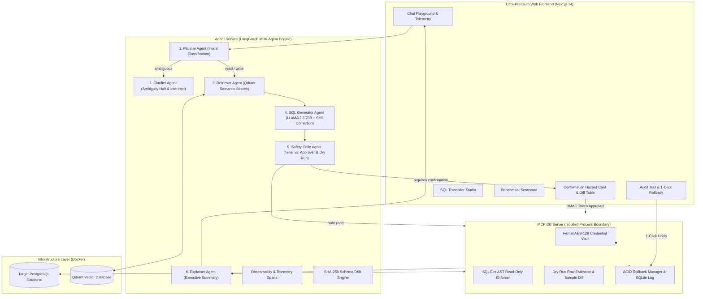

# Governed AI Database Copilot

[](https://github.com/rahulternamakki/SQL_Copilot/actions)
[](https://www.python.org/)
[](https://nextjs.org/)
[](https://langchain-ai.github.io/langgraph/)
[](https://groq.com/)
[](https://qdrant.tech/)
[](LICENSE)

An enterprise-grade, multi-agent AI database copilot engineered for production security, zero-hallucination grounding, and human-in-the-loop write governance.

---

## 🎯 The Four Fatal Flaws in Naïve SQL Copilots

Most text-to-SQL demonstrations fail when deployed into real-world enterprise databases due to four critical vulnerabilities:

1. **Leaked Credentials**: Directly exposing database connection strings and passwords to LLM prompt contexts.
2. **Silent Hallucinations**: Blindly inventing column names, table relationships, and joins not present in the live catalog.
3. **Ambiguity Guessing**: Making arbitrary assumptions on vague business terms (e.g., guessing how *"best employee"* or *"churn rate"* is calculated).
4. **Catastrophic Unchecked Mutations**: Executing unconstrained `UPDATE`, `DELETE`, or `DROP` statements without human approval or rollback capabilities.

**Governed AI Database Copilot solves all four with architectural guarantees.**

---

## 🏗️ System Architecture



---

## 🛡️ Core Governance Guarantees

### 1. Process-Isolated Security ("The Badge System")
- The LLM and Agent service have **zero direct access to database credentials**.
- Connection passwords and keys are encrypted at rest using AES-128 Fernet encryption (`vault.py`) inside an isolated Model Context Protocol (MCP) server running on a distinct port and process boundary.
- Read queries are checked using SQLGlot AST validation to physically reject write operations on read-only connections.

### 2. Zero-Hallucination Grounding & Ambiguity Interception
- Multi-tenant vector RAG in Qdrant (`copilot_{connection_id}`) chunks schemas and business glossary definitions.
- When queries contain subjective or undefined metrics (e.g. *"Who is our best employee?"*), the **Clarifier Agent immediately halts execution**, presents explicit disambiguation choices to the user, and resumes with bound business rules.

### 3. Teller vs. Approver Safety Isolation
- The SQL Generator is isolated from execution authority.
- The **Safety Critic Agent** inspects mutating SQL, executes an MCP dry-run (`SELECT COUNT(*)`), attaches an **Interactive Before-State Row Diff Table**, and generates a cryptographic HMAC-SHA256 confirmation token with a strict **5-minute expiration (300s TTL)**.

### 4. 1-Click Rollback Engine
- Every mutating transaction snapshots the exact before-state of all modified records into local SQLite storage (`rollback_log.db`).
- Deterministic inverse SQL (`INSERT` statements for `DELETE`, old column values for `UPDATE`) is generated in real-time, allowing users to undo changes with 1 click.

### 5. Self-Healing Schema Drift Detection
- Computes SHA-256 fingerprint hashes of database catalogs on session start.
- When DBAs alter tables outside the copilot, the system alerts the user and automatically triggers incremental Qdrant vector re-indexing without crashing.

### 6. Cross-Dialect SQL Transpiler Studio
- Converts SQL statements from `Snowflake`, `MySQL`, `BigQuery`, `SQLite`, `TSQL (SQL Server)`, and `Oracle` into standard PostgreSQL 16 dialect using `sqlglot`.

---

## 📊 Evaluation Benchmark Scorecard (30 / 30 Passed)

The system includes an automated evaluation harness ([`evals/eval_runner.py`](evals/eval_runner.py)) testing 30 categorized benchmark queries:

| Benchmark Category | Target Metric | Achieved Result | Status |
|---|---|---|---|
| **Ambiguity Interception Rate** | `100.0%` | **`100.0%`** | **PASSED ✅** |
| **Destructive Write Interception Rate** | `100.0%` | **`100.0%`** | **PASSED ✅** |
| **Overall Intent & Execution Accuracy** | `>= 75.0%` | **`100.0%`** | **PASSED ✅** |

*Full scorecard details available in [`evals/eval_scorecard.md`](evals/eval_scorecard.md).*

---

## 💻 Tech Stack Matrix

| Layer | Technology | Role |
|---|---|---|
| **Frontend UI** | Next.js 14 (App Router), TypeScript, Tailwind CSS, Lucide Icons | Ultra-premium responsive dark dashboard, telemetry badges, before-state diff tables |
| **Agent Orchestration** | LangGraph, Python 3.13, Pydantic v2 | Multi-agent state machine with human-in-the-loop interruption |
| **AI Inference** | Groq API (LLaMA 3.3 70B Versatile) | Low-latency SQL generation, auto-glossary drafting, and natural-language summaries |
| **Vector RAG** | Qdrant Vector DB, FastEmbed (`bge-small-en-v1.5`) | Tenant-isolated vector storage for schema catalog & business glossary |
| **Database Engine** | Model Context Protocol (MCP), SQLAlchemy 2.0, SQLGlot | AST parsing, dry-run row estimation, cross-dialect transpilation, process isolation |
| **Security & Vault** | Cryptography (Fernet AES-128), HMAC-SHA256 | Credential vault, cryptographic 5-minute confirmation tokens |
| **Rollback Storage** | SQLite (`rollback_log.db`) | ACID pre-state snapshots & inverse SQL generator |
| **Testing & CI** | Pytest, GitHub Actions | 20 unit tests, 30 benchmark evaluations, automated CI matrix |

---

## 🚀 Quickstart & Local Setup

### Prerequisites
- Python 3.11+ (Python 3.13 supported)
- Node.js 18+ and npm
- Docker and Docker Compose

### 1. Clone the Repository
```bash
git clone https://github.com/rahulternamakki/SQL_Copilot.git
cd SQL_Copilot
```

### 2. Environment Configuration
Copy the example environment file and configure your Groq API key:
```bash
cp .env.example .env
# Edit .env and set your GROQ_API_KEY (optional, system has offline fallbacks)
```

### 3. Launch the Complete Ecosystem with One Command
**On Windows (PowerShell):**
```powershell
.\scripts\start_all.ps1
```

**On Linux / Mac (Bash):**
```bash
chmod +x ./scripts/start_all.sh
./scripts/start_all.sh
```

### 4. Or Start Components Individually

**Start Database & Vector Containers:**
```bash
docker compose up -d
```

**Start MCP Database Server:**
```bash
cd apps/mcp-db-server
pip install -r requirements.txt
python server.py
# Server running at http://localhost:8001
```

**Start LangGraph Agent Service:**
```bash
cd apps/agent-service
pip install -r requirements.txt
python main.py
# API running at http://localhost:8000
```

**Start Next.js Frontend:**
```bash
cd apps/web
npm install
npm run dev
# Open http://localhost:3000
```

---

## 🧪 Running Tests & Evaluation Harness

**Run Pytest Test Suite (20 Unit Tests):**
```bash
python -m pytest
```

**Run Full 30-Question Evaluation Benchmark:**
```bash
python evals/eval_runner.py
```

---

## 🎬 3–5 Minute Guided Demo Script

For live interviews and presentations, refer to the complete walkthrough script:
👉 **[`docs/DEMO_SCRIPT.md`](docs/DEMO_SCRIPT.md)**

---

## 🔒 Multi-Tenant & Scalability Statement

Designed for per-user and per-database tenant isolation via scoped Qdrant vector namespaces (`copilot_{connection_id}`) and isolated MCP credential vaults. Not load-tested under heavy concurrent write contention.

---

## 📄 License
This project is licensed under the MIT License — see the [LICENSE](LICENSE) file for details.
